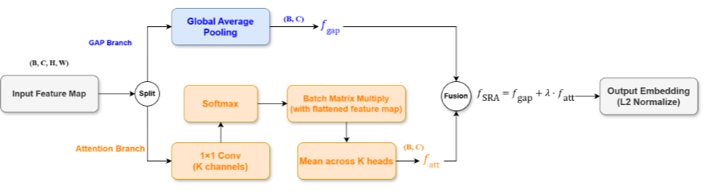

# Image Retrieval Thesis 2026

This repository contains the source code for our thesis on explainable medical image retrieval. It includes training and evaluation scripts for retrieval models, saliency and explainability utilities, and several dataset-specific workflows for chest X-ray and skin lesion experiments.

## Authors

- Nguyen Van Tu - nvtu22@clc.fitus.edu.vn
- Pham Nguyen Hai Long - pnhlong22@clc.fitus.edu.vn

## Thesis Contributions

This thesis focuses on two main contributions:

1. Spatial Residual Attention Module.
2. Dual Branch Loss.

## Architecture Proposal

The figure below shows the proposed architecture used in this thesis.



## Table Of Contents

- [What This Repo Does](#what-this-repo-does)
- [Authors](#authors)
- [Thesis Contributions](#thesis-contributions)
- [Architecture Proposal](#architecture-proposal)
- [Repository Layout](#repository-layout)
- [Setup](#setup)
- [Quickstart](#quickstart)
- [Data Preparation](#data-preparation)
- [Train A Model](#train-a-model)
- [Evaluate A Model](#evaluate-a-model)
- [Saliency And Explainability](#saliency-and-explainability)
- [Special Workflows](#special-workflows)
- [Reproducibility Notes](#reproducibility-notes)
- [Citation](#citation)
- [Contact](#contact)
- [Acknowledgment](#acknowledgment)
- [Disclaimer](#disclaimer)

## What This Repo Does

- Trains embedding models for medical image retrieval with deep metric learning.
- Evaluates trained models on COVID, ISIC, TBX11K, VinDr, NIH, and related datasets.
- Generates similarity-based saliency maps and insertion/deletion metrics.
- Supports model families such as DenseNet121, ResNet50, ConvNeXtV2, ConvNeXtV2-SRA, SwinV2, DINOv2, MedSigLIP, and ConceptCLIP.

## Repository Layout

- `train.py`: main training entry point.
- `test.py`: main evaluation entry point.
- `compute_saliency.py`, `compute_saliency_convnextv2.py`, `medsiglip_saliency.py`: saliency generation scripts.
- `evaluate_saliency.py`, `evaluate_test_dataset_milvus.py`, `test_retrieval_metrics.py`: evaluation helpers and metrics.
- `generate_single_saliency.py`: generate a single saliency output for a query image or query/retrieved pair.
- `concept_clip.py`, `xai_conceptclip.py`, `test_conceptclip.py`: ConceptCLIP experiments.
- `milvus/`, `retrieval_analysis/`, `fusion_eval/`, `ChestMIR/`: retrieval and analysis utilities.
- `anomaly/`: experimental anomaly-style training and evaluation.

## Setup

1. Create and activate a Python environment.
2. Install dependencies:

```bash
pip install -r requirements.txt
```

3. Prepare your dataset files and update the command-line paths in the examples below.

The repo was originally developed for GPU training. If you want reproducible results, keep your dataset split files fixed and reuse the same random seed, checkpoint, and embedding dimension across training and evaluation.

### Prerequisites

- Python 3.10 or newer is recommended.
- A CUDA-capable GPU is recommended for training and saliency generation.
- Install the Python packages listed in `requirements.txt`.
- Some scripts expect local dataset manifests and pretrained checkpoints.

## Quickstart

If you only want the shortest path to a working experiment, start here.

COVIDx training:

```bash
python train.py --dataset-dir /path/to/COVID/data --resume model.pth
```

COVIDx evaluation:

```bash
python test.py --test-dataset-dir /path/to/COVID/data/test --resume /path/to/checkpoint.pth
```

ISIC training with a custom embedding size:

```bash
python train.py \
  --dataset isic \
  --dataset-dir /path/to/ISIC-2017_Training_Data \
  --train-image-list ISIC-2017_Training_Part3_GroundTruth.csv \
  --test-image-list ISIC-2017_Test_v2_Part3_GroundTruth_balanced.csv \
  --embedding-dim 256
```

VinDr retrieval metrics:

```bash
python test_retrieval_metrics.py \
  --dataset vindr \
  --test-dataset-dir /path/to/VinDr/test \
  --test-image-list vindr/image_labels_test.csv \
  --model convnextv2_sra \
  --resume model_sra.pth \
  --k-values 1,5,10 \
  --vindr-label-mode all
```

## Data Preparation

The scripts expect you to point to your own local dataset folders and split files.

| Dataset   | Typical manifest / list file                                                                   | Notes                                               |
| --------- | ---------------------------------------------------------------------------------------------- | --------------------------------------------------- |
| COVIDx    | `train_split.txt`, `test_COVIDx4.txt`                                                          | Chest X-ray retrieval workflow                      |
| ISIC 2017 | `ISIC-2017_Training_Part3_GroundTruth.csv`, `ISIC-2017_Test_v2_Part3_GroundTruth_balanced.csv` | Skin lesion retrieval workflow                      |
| VinDr     | `vindr/image_labels_test.csv`                                                                  | Used in retrieval metrics and evaluation scripts    |
| TBX11K    | dataset-specific list file                                                                     | Check the script help for the exact expected format |
| NIH       | dataset-specific list file                                                                     | Check the script help for the exact expected format |

- COVIDx uses text manifests such as `train_split.txt` and `test_COVIDx4.txt`.
- ISIC 2017 uses CSV manifests such as `ISIC-2017_Training_Part3_GroundTruth.csv` and `ISIC-2017_Test_v2_Part3_GroundTruth_balanced.csv`.
- Other datasets such as VinDr, TBX11K, and NIH have their own dataset directories and manifest formats.

If a script mentions a dataset manifest, pass the correct local file path rather than relying on the defaults.

## Train A Model

Run the main training script with `train.py`. Trained checkpoints are saved in `./checkpoints` by default.

Basic usage:

```bash
python train.py --dataset-dir /path/to/data --resume model.pth
```

Example: train an ISIC retrieval model with a 256-dimensional embedding layer.

```bash
python train.py \
  --dataset isic \
  --dataset-dir /path/to/ISIC-2017_Training_Data \
  --train-image-list ISIC-2017_Training_Part3_GroundTruth.csv \
  --test-image-list ISIC-2017_Test_v2_Part3_GroundTruth_balanced.csv \
  --embedding-dim 256
```

Useful training flags include `--model`, `--embedding-dim`, `--loss-name`, `--epochs`, `--lr`, `--batch-size`, `--seed`, `--anomaly`, and `--freeze-backbone`.

## Evaluate A Model

Run `test.py` to evaluate a checkpoint. Results are saved in `./results` by default.

Basic usage:

```bash
python test.py --test-dataset-dir /path/to/test_data --resume /path/to/checkpoint.pth
```

Example: evaluate an ISIC model with a matching embedding size.

```bash
python test.py \
  --dataset isic \
  --test-dataset-dir /path/to/ISIC-2017_Test_v2_Data \
  --test-image-list ISIC-2017_Test_v2_Part3_GroundTruth_balanced.csv \
  --resume /path/to/isic_checkpoint.pth \
  --embedding-dim 256
```

Important: the embedding dimension used during evaluation must match the one used during training.

## Saliency And Explainability

The saliency code lives primarily in `explanations.py` and related scripts.

- `compute_saliency.py` generates saliency maps, including self-similarity variants.
- `evaluate_saliency.py` computes insertion and deletion metrics.
- `generate_single_saliency.py` creates a single saliency output for a query image or query/retrieved pair.

Example: generate a saliency map for one query image.

```bash
python generate_single_saliency.py \
  --query_image /path/to/query.png \
  --model_type convnextv2_sra \
  --model_weights /path/to/checkpoint.pth \
  --explainer simatt \
  --output_path outputs/saliency.npy \
  --device cuda
```

Example: generate a saliency map from a query/retrieved pair.

```bash
python generate_single_saliency.py \
  --query_image /path/to/query.png \
  --retrieved_image /path/to/retrieved.png \
  --model_type convnextv2_sra \
  --model_weights /path/to/checkpoint.pth \
  --explainer simatt \
  --output_path outputs/pair_saliency.npy
```

Note: some saliency scripts use `torch.nn.DataParallel`, so they may try to use all available GPUs. Set `CUDA_VISIBLE_DEVICES` if you want to restrict execution to a specific GPU.

## Special Workflows

- ConceptCLIP experiments: `test_conceptclip.py`, `concept_clip.py`, `xai_conceptclip.py`.
- Milvus-based retrieval experiments: `evaluate_test_dataset_milvus.py`, `milvus/`, `query_nih_zilliz.py`, `ingest_embeddings.py`.
- Multi-dataset analysis: `retrieval_analysis/` and `fusion_eval/`.
- Anomaly-style training: the `anomaly/` directory.

If you use one of these workflows, check the script help output first, because several of them have dataset-specific flags and local-path assumptions.

## Reproducibility Notes

- Use the same dataset split files when comparing results.
- Keep the same checkpoint and embedding dimension when re-running evaluation.
- Set the random seed with `--seed` when training.
- Record the exact command line, dataset paths, and model checkpoint for every experiment.

## Outputs

- Training checkpoints are written to `./checkpoints` unless you change `--save-dir`.
- Evaluation outputs are written to `./results` unless you change `--save-dir`.
- Saliency scripts often write `.npy`, `.json`, or image overlays depending on the command.
- Milvus and retrieval-analysis workflows may create additional files under `./results`, `./covid_results`, or the output directory you pass on the command line.

## Citation

If you use this repository in your research, please cite the thesis, paper, or report that introduced this codebase, along with the specific datasets and pretrained models you relied on.

Suggested citation text:

```text
Please cite the original explainable medical image retrieval work associated with this repository, together with the relevant dataset publications and any pretrained model sources used in your experiment.
```

## Contact

Questions about this thesis and source code can be directed to the authors:

- Nguyen Van Tu - nvtu22@clc.fitus.edu.vn
- Pham Nguyen Hai Long - pnhlong22@clc.fitus.edu.vn

For citation guidance, use the note above and adapt it to the exact paper, thesis, or report you are referencing.
